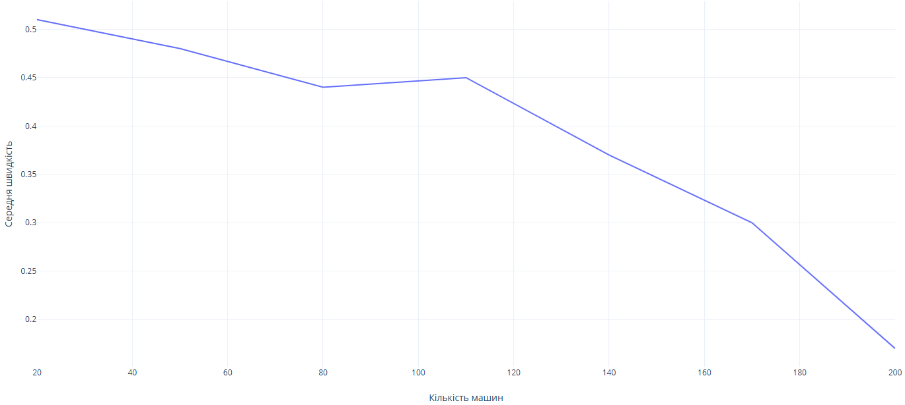
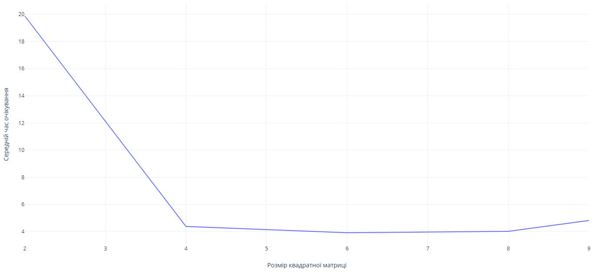
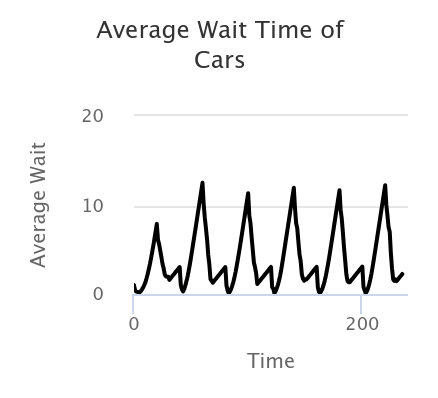

## Комп'ютерні системи імітаційного моделювання
## СПм-24-3, **Пономаренко Марк Олександрович**
### Лабораторна робота №**1**. Опис імітаційних моделей та проведення обчислювальних експериментів

 

### Варіант 1, модель у середовищі NetLogo:
[Traffic Grid](https://www.netlogoweb.org/launch#http://www.netlogoweb.org/assets/modelslib/Sample%20Models/Social%20Science/Traffic%20Grid.nlogo)

 

### Вербальний опис моделі:
Симуляція руху транспорту в міській мережі. Рух автомобілів регулюється світофорами. Можна змінювати глобальні змінні, такі як обмеження швидкості та кількість автомобілів, а також досліджувати динаміку руху. Модель показує, як можуть утворюватись пробки в середовищі насиченому перешкодами та трафіком.
### Керуючі параметри:
- **grid-size-x/grid-size-y** визначає розмірність дорожної матриці.
- **num-cars** визначає транспорту керуємого агентом.

### Внутрішні параметри:
- **speed**. Швидкість агенту (переміщення машини трасою). Може відрізнятись у кожної машини в різні моменти модельного часу.
- **speed-limit**. Обмеження максимальної швидкості. Це загальний параметр для всіх агентів.
- **current phase** контролює, коли змінюється поточне освітлення, якщо воно перебуває в автоматичному режимі.

### Показники роботи системи:
- кількість автомобілів, що зупинились. Не може перевизувати загальну кількість автомобілів.
- середня швидкість транспорту.
- середній час очікування (час простою).

### Примітки:
При налаштуваннях керуючих параметрів за замовчуванням, періодично відбуваються піки зупинок.

### Недоліки моделі:
Агент йде лише вперед не шукаючи оптимального шляху, що в принципі протележне до сучасних навігаційних систем, має велику стартову швидкість та не встигає адекватно тормозити. Також, було б гарно якщо була б можливість змінювати відстань між світофорами.

 

## Обчислювальні експерименти

### 1. Вплив завантаженості дороги на середню швидкість переміщення нею
Досліджується залежність середньої швидкості протягом певної кількості тактів (200) від числа машин на матриці, зазначеного на початку симуляції.
Експерименти проводяться при 20-200 машинах, з кроком 30, усього 7 симуляцій.  
Інші керуючі параметри мають значення за замовчуванням:
- **grid-size-x/grid-size-y**: 5
<table>
<thead>
<tr><th>Кількість автомобілів</th><th>Середня швидкість</th></tr>
</thead>
<tbody>
<tr><td>20</td><td>0,51</td></tr>
<tr><td>50</td><td>0,48</td></tr>
<tr><td>80</td><td>0,44</td></tr>
<tr><td>110</td><td>0,45</td></tr>
<tr><td>140</td><td>0,37</td></tr>
<tr><td>170</td><td>0,30</td></tr>
<tr><td>200</td><td>0,17</td></tr>
</tbody>
</table>

Графік наочно показує, що утримання високої швидкості можливе лише за її низької завантаженості.

### 2. Перевірка наскільки критично впливає наявність світлофорів на кількість зупинок траспорту
Проведемо моделювання з та без світофорів. Проведемо 3 ітерації зі змінною кількістю машин та потім ще раз але без світлофорів.

<table>
<thead>
<tr><th>Кількість автомобілів</th><th>Середня к-ть зупинок зі світлофором</th><th>Середня к-ть зупинок без світлофору</th></tr>
</thead>
<tbody>
<tr><td>20</td><td>9</td><td>0</td></tr>
<tr><td>110</td><td>51</td><td>46</td></tr>
<tr><td>200</td><td>146</td><td>133</td></tr>
</tbody>
</table>
Здавалось би, що світофори не потрібні, але з часом симуляції кількість зупиненого транспорту зростатиме без світлофору. Світлофор, хоч і призводить до зупинок, можливо не обов'язкових, але не дає встати трафіку в час-пік.

### 3. Вплив розмірності матриці на середній час очікування
Проведемо наступний експеримент - змінюємо розмірність матриці та спостерігаємо як змінюється середній час очікування.
- **num-cars**: 100
<table>
<thead>
<tr><th>Розмір по Х</th><th>Розмір за У</th><th>Середній час очікування</th></tr>
</thead>
<tbody>
<tr><td>2</td><td>2</td><td>19.88</td></tr>
<tr><td>4</td><td>4</td><td>4.38</td></tr>
<tr><td>8</td><td>8</td><td>3.92</td></tr>
<tr><td>8</td><td>8</td><td>4.02</td></tr>
<tr><td>9</td><td>9</td><td>4.82</td></tr>
</tbody>
</table>

Далі спробуємо декілька неквардратних матриць.

<table>
<thead>
<tr><th>Розмір по Х</th><th>Розмір за У</th><th>Середній час очікування</th></tr>
</thead>
<tbody>
<tr><td>3</td><td>6</td><td>3.76</td></tr>
<tr><td>6</td><td>3</td><td>4.03</td></tr>
<tr><td>2</td><td>9</td><td>3.31</td></tr>
<tr><td>9</td><td>2</td><td>2.61</td></tr>
</tbody>
</table>

Далі спробуємо декілька неквардратних матриць. Неквадратні матриці відрізняються тим, що деяка група автомобілів доходить до перехрестя першої ніж інша. Це видно по графам. Загалом, розмірність матриці слід підбирати автоматизованим чином до відповідної кількості транспорту.