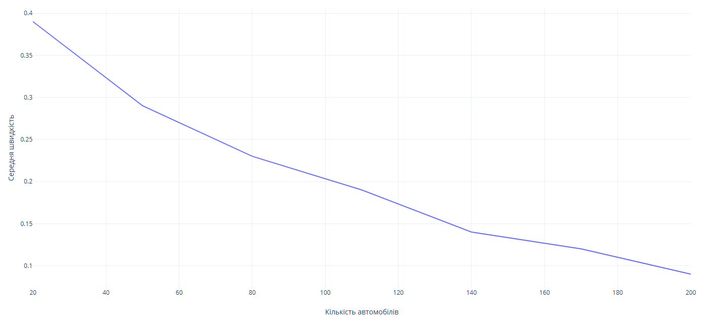

## Комп'ютерні системи імітаційного моделювання
## СПм-24-3, **Пономаренко Марк Олександрович**
### Лабораторна робота №**1**. Опис імітаційних моделей та проведення обчислювальних експериментів

 

### Варіант 1, модель у середовищі NetLogo:
[Traffic Grid](https://www.netlogoweb.org/launch#http://www.netlogoweb.org/assets/modelslib/Sample%20Models/Social%20Science/Traffic%20Grid.nlogo)

 

### Внесені зміни у вихідну логіку моделі, за варіантом:
Додати жовтий сигнал світлофорів. Додати вірогідність початку руху водіями не тільки на зелений, але і на жовтий сигнал світлофора.
Замість
<pre>
  green-light-up?
</pre>

Додаємо стани
<pre>
  light-state     ;; "green", "yellow", or "red"
  last-state  
</pre>

Відповідно змінюється логіка зміни сигналів.
Замість
<pre>
to set-signals
  ask intersections with [auto? and phase = floor ((my-phase * ticks-per-cycle) / 100)]
  [
    set green-light-up? (not green-light-up?)
    set-signal-colors
  ]
end
</pre>
робимо зміну за станами. 
<pre>
to set-signals
  ask intersections with [auto? and phase = floor ((my-phase * ticks-per-cycle) / 100)]
  [
    ;; cycle through green yellow red yellow  green
    ifelse light-state = "green" or light-state = "red" 
    [
      set last-state light-state
      set light-state "yellow"
    ]
    [
      if light-state = "yellow" 
      [
        ifelse last-state = "red"
        [
	      set light-state "green"
        ]
        [
          set light-state "red"
        ]
        set last-state "yellow"
    	]
    ]

    set-signal-colors
  ]
end
</pre>
Відповідно від зміни сигналів і залежить зміна кольорів.

Додаємо шанс на проходження перехрестку на жовте світло.
<pre>
to set-car-speed  ;; turtle procedure
  if pcolor = red
  [ set speed 0 ]
  ifelse pcolor = yellow
  [
    ifelse random 100 > 75
    [
      set speed speed
    ]
    [
      set speed 0
    ]
  ]
  [
    ifelse up-car?
    [ set-speed 0 -1 ]
    [ set-speed 1 0 ]
  ]
end
</pre>

### Внесені зміни у вихідну логіку моделі, на власний розсуд:
Додані періодичні відключення світлофорів від мережі. З певним інтервалом світлофори вимикаються на вказаний час.
Додано нові глобальні змінні.
<pre>
  power-timer         ;; counts ticks since last change
  power-on-duration   ;; how long lights stay on
  power-off-duration  ;; how long lights stay off
</pre>
Також додано нову процедуру, що керує електроенергією.
<pre>
to manage-power
  set power-timer power-timer + 1

  if power? [
    if power-timer >= power-on-duration [
      set power? false
      set power-timer 0
    ]
  ]
  if not power? [
    if power-timer >= power-off-duration [
      set power? true
      set power-timer 0
    ]
  ]
end
</pre>
Викликається ця процедура в головній процедурі go.
<pre>
to go

  update-current
  manage-power
  ;; have the intersections change their color
  set-signals
  set num-cars-stopped 0

  ;; set the turtles speed for this time thru the procedure, move them forward their speed,
  ;; record data for plotting, and set the color of the turtles to an appropriate color
  ;; based on their speed
  ask turtles [
    set-car-speed
    fd speed
    record-data
    set-car-color
  ]

  ;; update the phase and the global clock
  next-phase
  tick
end
</pre>

 

## Обчислювальні експерименти

### 1. Вплив завантаженості дороги на середню швидкість переміщення нею
Досліджується залежність середньої швидкості протягом певної кількості тактів (200) від числа машин на матриці, зазначеного на початку симуляції.
Експерименти проводяться при 20-200 машинах, з кроком 30, усього 7 симуляцій.  
Цей експеримент має на меті порівняти результати до та після змін з першої лабораторної роботи. Використовуться зміни за варіантом.
<table>
<thead>
<tr><th>Кількість автомобілів</th><th>Середня швидкість</th></tr>
</thead>
<tbody>
<tr><td>20</td><td>0.39</td></tr>
<tr><td>50</td><td>0.29</td></tr>
<tr><td>80</td><td>0.23</td></tr>
<tr><td>110</td><td>0.19</td></tr>
<tr><td>140</td><td>0.14</td></tr>
<tr><td>170</td><td>0.12</td></tr>
<tr><td>200</td><td>0.09</td></tr>
</tbody>
</table>

Порівнюючи результати, спостерігається, що при введенні проміжного сигналу присутня тенденція до більшого сповільнення. 

### 2. Вплив періодиченого відключення електроенергії на середню швидкість трафіку
Проведемо моделювання при відключення світла. Проведемо 3 ітерації зі змінною кількістю машин та порівняємо з попереднім експериментом.

<table>
<thead>
<tr><th>Кількість автомобілів</th><th>Середня к-ть зупинок зі світлофором</th></tr>
</thead>
<tbody>
<tr><td>50</td><td>0.44</td></tr>
<tr><td>100</td><td>0.28</td></tr>
<tr><td>150</td><td>0.20</td></tr>
</tbody>
</table>

Видно, що при відключеннях світла середня швидкість збільшується, але модель не включає в себе обробку аварій. При увімкнених проміжних сигналах, шанс на аварії менший, але середня швидкість менша.
