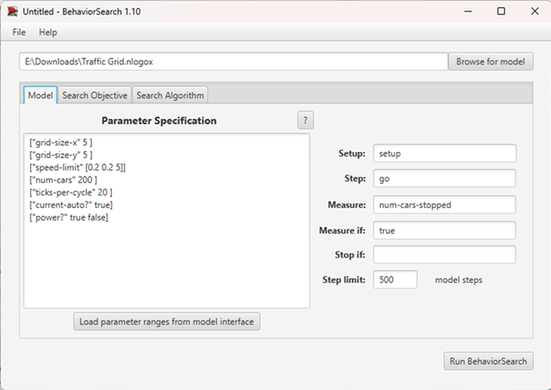
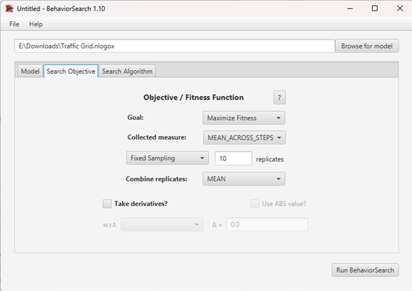
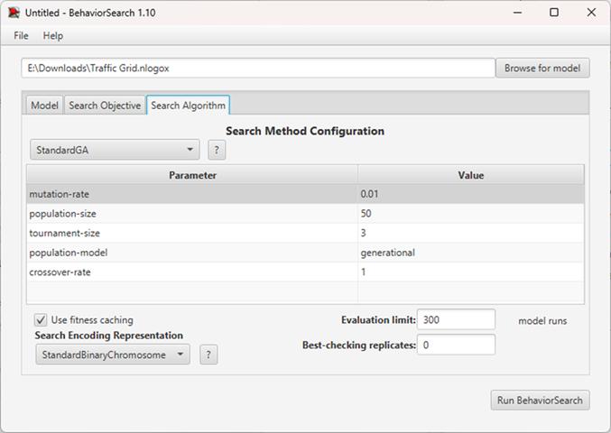
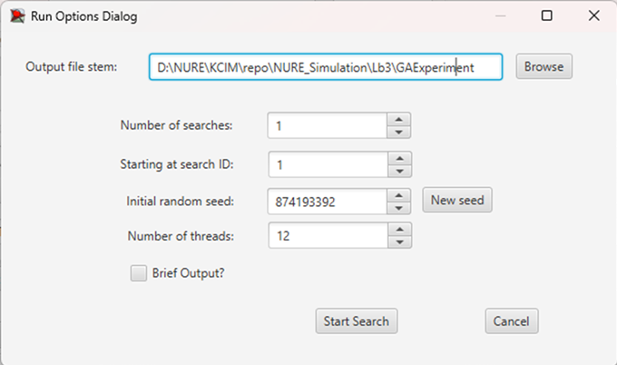
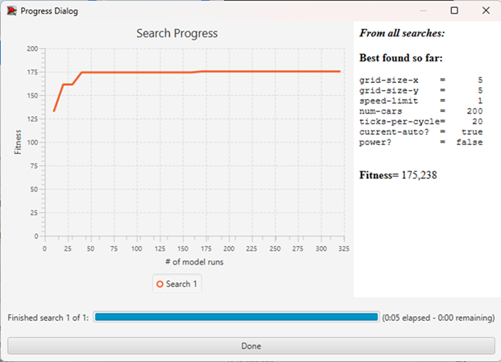
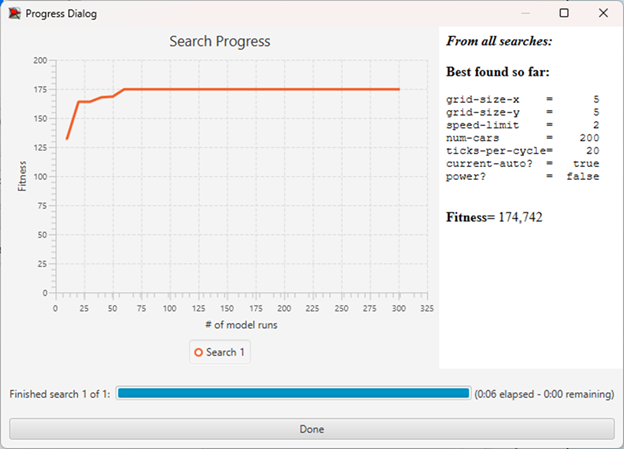

## Комп'ютерні системи імітаційного моделювання
## СПм-24-3, **Пономаренко Марк Олександрович**
### Лабораторна робота №**3**. Використання засобів обчислювального интелекту для оптимізації імітаційних моделей

 

### Варіант 1, модель у середовищі NetLogo:
[Traffic Grid](https://www.netlogoweb.org/launch#http://www.netlogoweb.org/assets/modelslib/Sample%20Models/Social%20Science/Traffic%20Grid.nlogo)

 

### Вербальний опис моделі:
Базова версія Trafic Grid використана на першій лабораторній роботі. В модифікованій версії неможливо додати power? як параметр, адже він керується в коді. Тому було вирішено використати базову версію.
#### Керуючі параметри:
- **number-of-cars** визначає кількість агентів у середовищі.
- **speed-limit** визначає максимальну швидкість агентів у середовищі.
- **power?** визначає чи увімкнені світлофори.
- **grid-size** визначає розмірність матриці.

#### Показники роботи модеі:
- кількість зупинених агентів.
- середня швидкість агентів на такті.
- середній час очікування.
 

### Налаштування середовища BehaviorSearch:

Параметри та їх можливі діапазони були автоматично отримані та пізніше підлаштовані вручну.
<pre>
["grid-size-x" 5 ]
["grid-size-y" 5 ]
["speed-limit" [0.2 0.2 5]]
["num-cars" 200 ]
["ticks-per-cycle" 20 ]
["current-auto?" true]
["power?" true false]
</pre>
Покажчиком результату є nums-cars-stopped.
 
 
 
Налаштування цільової функції.
  
 
Налаштування алгоритму пошуку.
  
 

### Результати використання BehaviorSearch:
Налаштування симуляції.
 

Результат пошуку параметрів імітаційної моделі, використовуючи **генетичний алгоритм**:  
  

Результат пошуку параметрів імітаційної моделі, використовуючи **випадковий пошук**:  
  